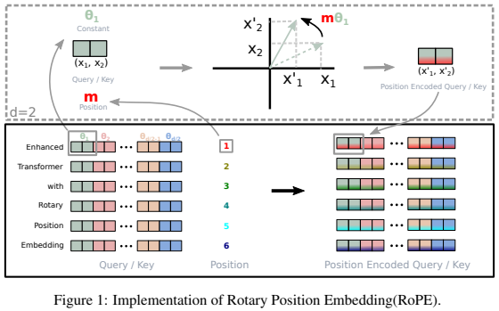

## LLaMA 2 from scratch 
- Including Rotary Positional Encoding, RMS Normalization, Multi Query Attention, KV Cache, Grouped Query Attention (GQA), the SwiGLU Activation function, ..

---

## LLaMA 2 Architecture and Model Overview

  
   
  Source: <a href="https://docs.nvidia.com/deeplearning/transformer-engine-releases/release-1.11/user-guide/examples/te_llama/tutorial_accelerate_hf_llama_with_te.html">Nvidia llama doc</a>

---

### LLaMA References

- [LLaMA: Open and Efficient Foundation Language Models](https://arxiv.org/pdf/2302.13971)
- [Llama 2: Open Foundation and Fine-Tuned Chat Models](https://arxiv.org/pdf/2307.09288)

---

## Rotary Positional Encoding (RoPE) from Scratch

### Overview

A comprehensive exploration of positional encoding methods from basic binary patterns to state-of-the-art RoPE implementation.

### What's Covered

**1. Binary Positional Encoding**
- Implementation of absolute binary position encoding
- Analysis of frequency-based position representation
- Pros/cons discussion

**2. Sinusoidal Encoding (Sine-only)**
- Implementation using only sine waves
- Exploration of limitations with single trigonometric function
- Mathematical analysis of missing information

**3. Sinusoidal Encoding (Sine + Cosine)**
- Full implementation following "Attention is All You Need"

$$PE(pos, 2i) = \sin\left(\frac{pos}{10000^{2i/d_{model}}}\right)$$

$$PE(pos, 2i+1) = \cos\left(\frac{pos}{10000^{2i/d_{model}}}\right)$$

- Derivation of relative position properties
- Analysis of addition vs. rotation for token embeddings

**4. Rotary Position Embedding (RoPE)**
- Mathematical derivation from sinusoidal properties
- Rotation matrix formulation:

$$R_m = \begin{bmatrix}
\cos(m\theta) & -\sin(m\theta) \\
\sin(m\theta) & \cos(m\theta)
\end{bmatrix}$$

- How rotation encodes relative positions: $R_m^T R_n = R_{n-m}$
- Similarity computation between rotated queries and keys

**5. Three RoPE Implementations**
- **Version 1:** Direct matrix multiplication (paper formulation)
- **Version 2:** Optimized element wise operations
- **Version 3:** Complex plane representation

  

### Interactive Notebook

Complete implementation with mathematical derivations, visualizations, and comparisons:

[positional_encoding_methods.ipynb](https://github.com/samitha278/CoreLlama/blob/main/positional_encoding_methods.ipynb)

### References

- [RoFormer: Enhanced Transformer with Rotary Position Embedding](https://arxiv.org/pdf/2104.09864) (Original RoPE Paper)
- [Designing Positional Encoding](https://huggingface.co/blog/designing-positional-encoding) (Hugging Face)

---

## RMS Normalization

### From Layer Normalization to RMS Norm

**Layer Normalization** computes two statistics to normalize activations:

$$\text{LayerNorm}(x) = \gamma \cdot \frac{x - \mu}{\sqrt{\sigma^2 + \epsilon}} + \beta$$

where:
- $\mu = \frac{1}{d}\sum_{i=1}^{d} x_i$ (mean - re-centering)
- $\sigma^2 = \frac{1}{d}\sum_{i=1}^{d} (x_i - \mu)^2$ (variance - re-scaling)

### RMS Norm Hypothesis

**Key Insight:** Recentering (subtracting mean) may not be necessary. Only rescaling provides the main benefit.

**RMS Normalization** uses only one statistic - the Root Mean Square:

$$\text{RMSNorm}(x) = \gamma \cdot \frac{x}{\text{RMS}(x)}$$

where:

$$\text{RMS}(x) = \sqrt{\frac{1}{d}\sum_{i=1}^{d} x_i^2 + \epsilon}$$

### Advantages

**Simpler:** No mean computation needed  
**Faster:** ~10-15% speedup over LayerNorm  
**Effective:** Empirically performs as well as LayerNorm  
**Stable:** Better gradient flow in deep networks

- Implementation : [norm_methods.ipynb](https://github.com/samitha278/CoreLlama/blob/main/norm_methods.ipynb)

### References

- [Root Mean Square Layer Normalization](https://arxiv.org/pdf/1910.07467) (Original RMSNorm Paper)

---